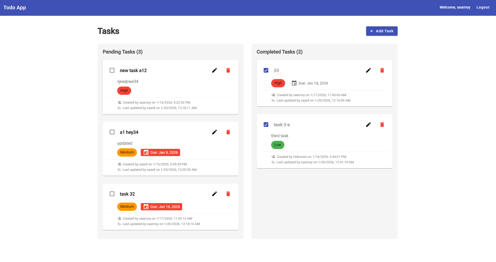

# Real-Time To-Do Application

A full-stack real-time To-Do application built with Angular, Node.js, Express, MongoDB, and WebSockets. This application demonstrates real-time data synchronization across multiple clients, edit locking mechanisms, and modern web development practices.

## 🚀 Quick Start

Get the application running in 4 easy steps:

1. **Install Dependencies**:
   ```bash
   # In root directory
   cd backend && npm install
   cd ../frontend && npm install
   ```
2. **Environment Setup**:
   - Create `backend/.env` (use `backend/.env.example` as template)
   - Ensure **MongoDB** is running locally
3. **Run Application**:
   - **Terminal 1 (Backend)**: `cd backend && npm run dev`
   - **Terminal 2 (Frontend)**: `cd frontend && npm start`
4. **Access**: Open [http://localhost:4200](http://localhost:4200)

---



## Features

- **Real-Time Updates**: Changes made by one client are instantly reflected in all connected clients via WebSocket
- **Edit Locking**: Prevents concurrent edits - only one user can edit a task at a time
- **Authentication**: JWT-based authentication with secure login/register
- **Task Management**: 
  - Create, read, update, and delete tasks
  - Mark tasks as completed/incomplete
  - Set task priority (Low, Medium, High)
  - Add due dates to tasks
- **Modern UI**: Built with Angular Material for a clean, responsive design
- **Type Safety**: Full TypeScript implementation across frontend and backend

## Technology Stack

### Frontend
- **Angular 21** - Frontend framework
- **Angular Material** - UI component library
- **RxJS** - Reactive programming for real-time updates
- **TypeScript** - Type-safe development

### Backend
- **Node.js** - Runtime environment
- **Express.js** - Web framework
- **TypeScript** - Type-safe development
- **MongoDB** - Database with Mongoose ODM
- **WebSocket (ws)** - Real-time communication
- **JWT** - Authentication

## Project Structure

```
SaarShob/
├── backend/               # Node.js/Express backend (TypeScript)
│   ├── src/
│   │   ├── config/        # Configuration files
│   │   ├── controllers/   # Request handlers
│   │   ├── models/        # Mongoose models
│   │   ├── repositories/  # Repository pattern implementation
│   │   ├── routes/        # API routes
│   │   ├── services/      # Business logic services
│   │   ├── middleware/    # Auth, error handling
│   │   ├── websocket/     # WebSocket server logic
│   │   ├── types/         # TypeScript interfaces/types
│   │   └── server.ts       # Entry point
│   ├── tsconfig.json      # TypeScript configuration
│   └── package.json
├── frontend/              # Angular application
│   ├── src/
│   │   ├── app/
│   │   │   ├── core/      # Core services, guards, interceptors
│   │   │   ├── features/
│   │   │   │   ├── auth/   # Authentication module
│   │   │   │   └── todos/  # Todo module
│   │   │   ├── shared/     # Shared components, models, utilities
│   │   │   └── app.component.*
│   │   └── ...
│   └── package.json
└── README.md
```

## Design Decisions and Patterns

### Key Design Decisions

1. **WebSockets for Real-Time Sync**: We chose WebSockets (via the `ws` library) over Polling or Server-Sent Events (SSE) to ensure true bi-directional, low-latency communication. This is crucial for the "edit locking" feature where state changes must be broadcasted immediately.
2. **Edit Locking Mechanism**: To prevent the "lost update" problem in a collaborative environment, we implemented a server-side locking mechanism. This ensures that only one user can modify a specific task at a time, providing a smoother collaborative experience.
3. **MongoDB for Flexibility**: A NoSQL database was chosen for its schema flexibility, which is beneficial for evolving task structures (e.g., adding priority, due dates, or sub-tasks without complex migrations).
4. **Separation of Concerns**: The project follows a strict multi-layered architecture (Controller -> Service -> Repository) to ensure maintainability, testability, and clear boundaries between business logic and data access.

### Backend Patterns

1. **Repository Pattern**: Abstracted data access layer
   - `BaseRepository` - Generic CRUD operations
   - `TaskRepository` - Task-specific operations
   - `UserRepository` - User-specific operations

2. **Service Pattern**: Business logic separation
   - `AuthService` - Authentication and authorization
   - `TaskService` - Task business logic and lock management
   - `WebSocketService` - Real-time communication management

3. **Middleware Pattern**: Request processing pipeline
   - `auth.middleware` - JWT token verification
   - `error.middleware` - Centralized error handling
   - `lock.middleware` - Task lock validation

4. **Singleton Pattern**: WebSocket server instance and database connection

### Frontend Patterns

1. **Service Pattern**: Business logic and data management
   - `AuthService` - Authentication state management
   - `TodoService` - Task CRUD operations and real-time updates
   - `WebSocketService` - WebSocket connection and event handling

2. **Observer Pattern**: RxJS for reactive data streams
   - Observables for real-time task updates
   - BehaviorSubjects for state management

3. **Guard Pattern**: Route protection
   - `AuthGuard` - Protects routes requiring authentication

4. **Interceptor Pattern**: HTTP request/response manipulation
   - `TokenInterceptor` - Adds JWT token to requests

## Setup Instructions

### Prerequisites

- Node.js (v18 or higher)
- MongoDB (v6 or higher)
- npm or yarn

### Backend Setup

1. Navigate to the backend directory:
```bash
cd backend
```

2. Install dependencies:
```bash
npm install
```

3. Create a `.env` file in the backend directory (use `.env.example` as a template):
```env
PORT=3000
NODE_ENV=development
MONGODB_URI=mongodb://localhost:27017/todoapp
JWT_SECRET=your-super-secret-jwt-key-change-this-in-production
JWT_EXPIRES_IN=7d
FRONTEND_URL=http://localhost:4200
```

4. Make sure MongoDB is running on your system

5. Start the backend server:
```bash
# Development mode (with hot reload)
npm run dev

# Production mode
npm run build
npm start
```

The backend server will run on `http://localhost:3000`

### Frontend Setup

1. Navigate to the frontend directory:
```bash
cd frontend
```

2. Install dependencies:
```bash
npm install
```

3. Update environment files if needed:
   - `src/environments/environment.ts` - Development environment
   - `src/environments/environment.prod.ts` - Production environment

4. Start the development server:
```bash
npm start
```

The frontend application will run on `http://localhost:4200`

## API Endpoints

### Authentication
- `POST /api/auth/register` - Register a new user
- `POST /api/auth/login` - Login user

### Tasks
- `GET /api/tasks` - Get all tasks for authenticated user
- `GET /api/tasks/:id` - Get task by ID
- `POST /api/tasks` - Create a new task
- `PUT /api/tasks/:id` - Update a task (requires lock)
- `DELETE /api/tasks/:id` - Delete a task (requires lock)
- `POST /api/tasks/:id/lock` - Acquire edit lock on a task
- `DELETE /api/tasks/:id/lock` - Release edit lock on a task

### WebSocket Events
- `task:created` - Broadcasted when a task is created
- `task:updated` - Broadcasted when a task is updated
- `task:deleted` - Broadcasted when a task is deleted
- `task:locked` - Broadcasted when a task is locked
- `task:unlocked` - Broadcasted when a task is unlocked

## Real-Time Synchronization

The application uses WebSocket for real-time updates:

1. When a client connects, they authenticate using their JWT token
2. All CRUD operations broadcast events to all connected clients
3. Clients receive updates and automatically update their UI
4. Edit locks are also synchronized in real-time

## Edit Locking Mechanism

To prevent concurrent edits:

1. When a user wants to edit a task, they must first acquire a lock
2. The lock is stored in the database with `lockedBy` (userId) and `lockedAt` (timestamp)
3. Locks expire after 5 minutes of inactivity
4. Other users cannot edit or delete a locked task
5. The lock is automatically released after an update or can be manually released
6. Lock status is broadcasted to all clients in real-time

## Environment Variables

### Backend (.env)
- `PORT` - Server port (default: 3000)
- `NODE_ENV` - Environment (development/production)
- `MONGODB_URI` - MongoDB connection string
- `JWT_SECRET` - Secret key for JWT tokens
- `JWT_EXPIRES_IN` - JWT token expiration time
- `FRONTEND_URL` - URL of the frontend application (for CORS)

### Frontend (environment.ts)
- `apiUrl` - Backend API URL
- `wsUrl` - WebSocket server URL

## Running the Application

1. Start MongoDB:
```bash
mongod
```

2. Start the backend (in one terminal):
```bash
cd backend
npm run dev
```

3. Start the frontend (in another terminal):
```bash
cd frontend
npm start
```

4. Open your browser and navigate to `http://localhost:4200`

5. Register a new account or login

6. Create tasks and test real-time synchronization by opening multiple browser windows/tabs

## Testing Real-Time Features

1. Open the application in two different browser windows/tabs
2. Login with the same or different accounts
3. Create, update, or delete a task in one window
4. Observe the changes appear instantly in the other window
5. Try to edit a task that's already being edited by another user - you should see a lock message

## Code Quality

- **TypeScript**: Full type safety across the application
- **Clean Code**: Separation of concerns, single responsibility principle
- **Error Handling**: Centralized error handling with meaningful messages
- **Validation**: Input validation on both frontend and backend
- **Security**: JWT authentication, password hashing with bcrypt

## Future Enhancements

- Unit and integration tests
- Task categories/tags
- Task search and filtering
- User profiles and settings
- Task sharing between users
- Push notifications
- Offline support with service workers

## License

This project is created for interview/assessment purposes.

## Author

Created as part of CityShob full-stack developer interview assessment.
